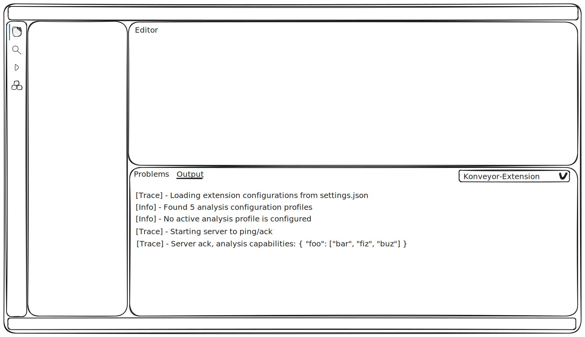
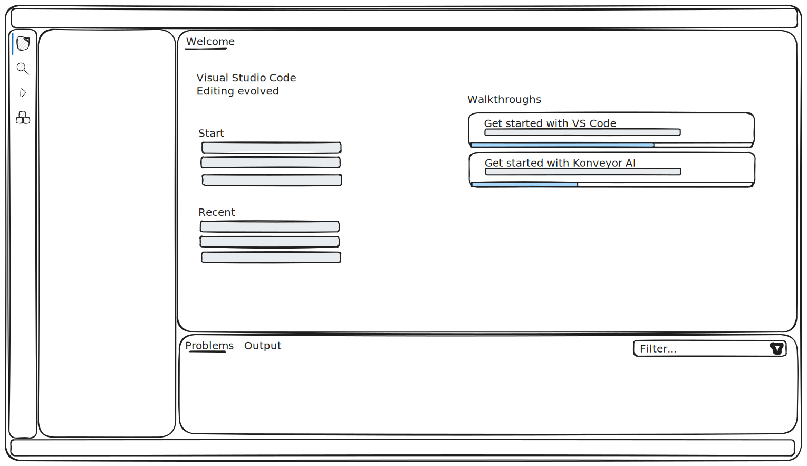
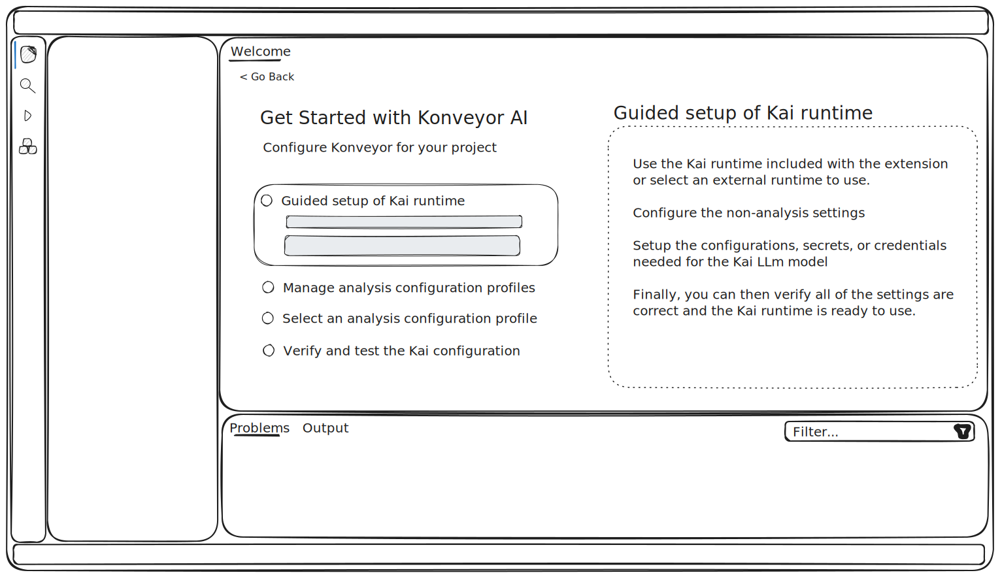
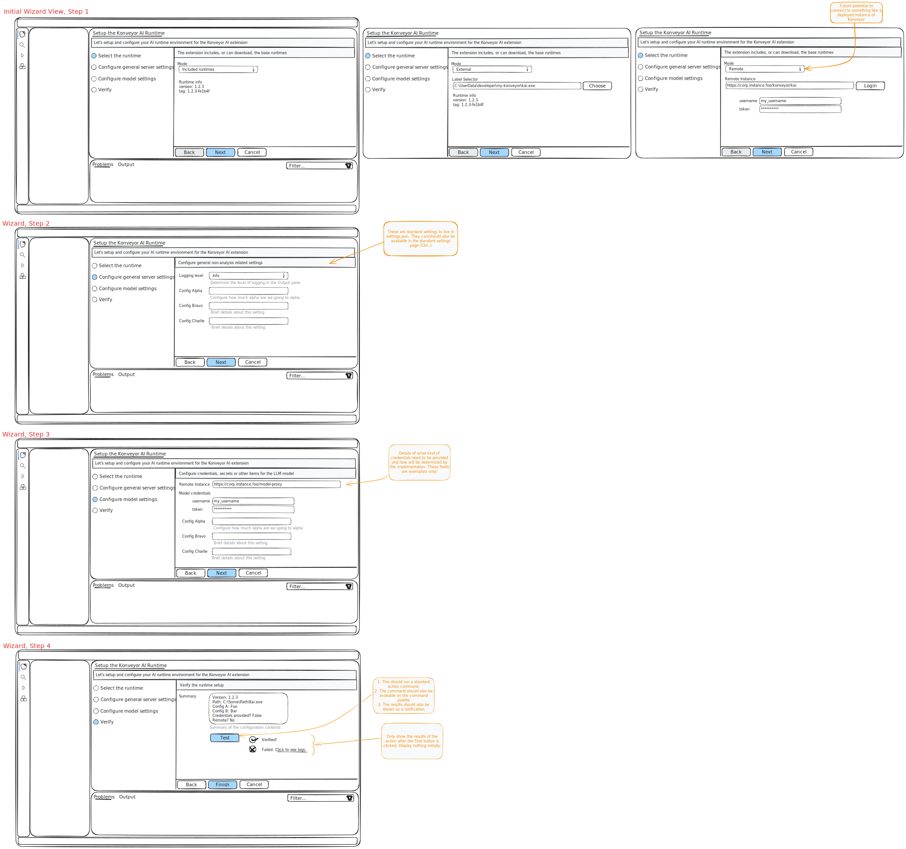
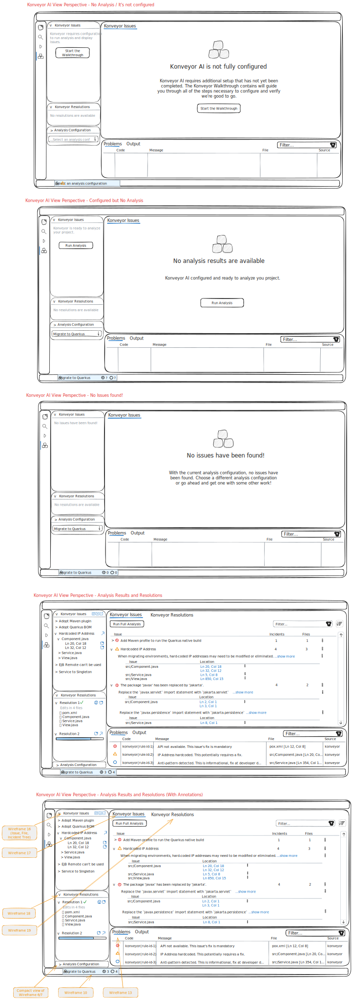
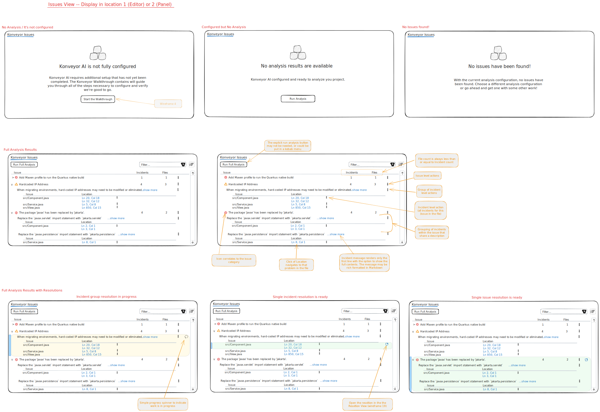
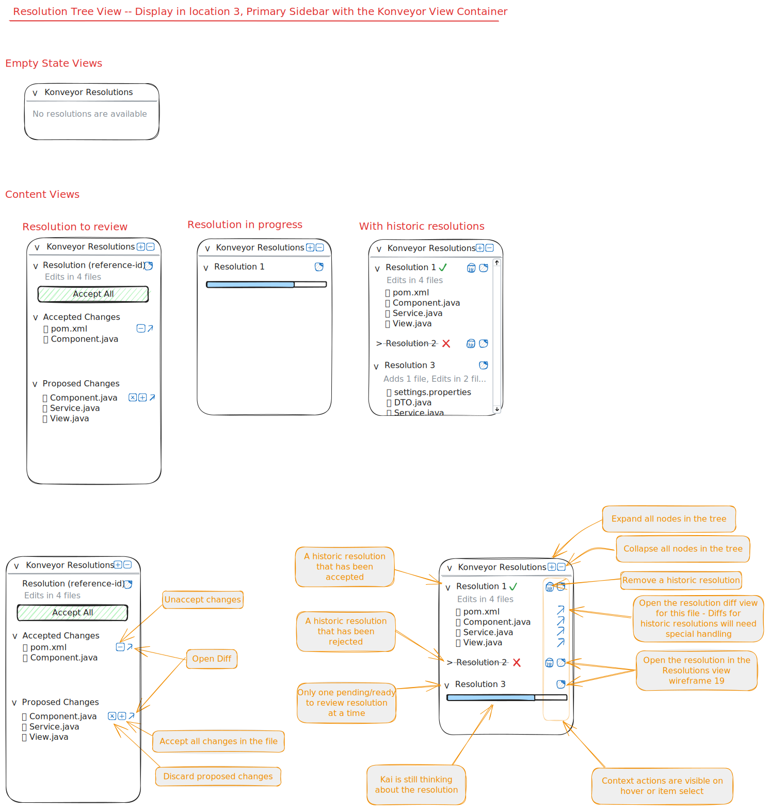

# Catalog of wire frames

Based on the [user stories](./README.md), the set of wire frames needed to implement the stories are listed here.

## TOC

  1. [Output channel for displaying trace/debug information](#wf-1)
  2. [Command palette](#wf-2)
  3. [Extension specific welcome page](#wf-3)
  4. [Walkthrough with steps](#wf-4)
  5. [Guided setup of Kai runtime Wizard](#wf-5)
  6. [Manage analysis configuration profiles](#wf-6)
  7. [Quick pick menu for analysis configuration profiles](#wf-7)
  8. [Quick pick menu for managing the Kai server](#wf-8)
  9. [Quick pick menu for an active file](#wf-9)
  10. [Global status bar item (for the Workspace) -- for extension/analysis](#wf-10)
  11. [Global status bar item (for the Workspace) -- for Kai resolution](#wf-11)
  12. [Context status bar item (for the Editor)](#wf-12)
  13. [Problems view](#wf-13)
  14. [Konveyor AI View Container](#wf-14)
  15. [Code editor (for viewing issues and incidents)](#wf-15)
  16. [Issue tree view](#wf-16)
  17. [Issue view](#wf-17)
  18. [Kai resolutions tree view](#wf-18)
  19. [Kai resolutions view](#wf-19)
  20. [Accept/Reject suggested resolutions](#wf-20)

## Wireframes

  0. Layout / display areas of the IDE

      

  1.  Output channel for displaying trace/debug information
      - Multiple channels are ok as long it is obvious what each channel will display.  There may be technical/debug value in having a channel for:
        - extension processing (settings, start, stop, restart of the server)
        - analyzer processing
        - Kai processing

      

  2. Command palette
      - Every entity (command, quick pick menu, and view) that is available in the extension should have a command palette entry to activate/display the entity

      

  3. Extension specific welcome page, or general Welcome page having Konveyor walkthroughts on the getting started list

      

  4. Walkthrough with steps:
      - Guided setup of Kai runtime
      - Manage analysis configuration profiles
      - Select active analysis configuration profile

      

  5. Guided setup of Kai runtime Wizard (editor view) with steps:
      - Select runtime
      - Configure the non-analysis configurations settings
      - Configure credentials/secrets/configurations needed for the LLM
      - Verify the Kai runtime can be started with feedback in the view

      

  6. Manage analysis configuration profiles (editor view)
      - View a list of __packaged__ and __user__ profiles
      - View the details of a single profile
      - Create a new empty profile
        - A user create profile is where custom rules can be attached
        - __Managing custom rules will need attention__
      - Duplicate an existing profile
      - Remove a user created profile

      

  7. Quick pick menu for analysis configuration profiles
      - Pick one of the profiles
      - Open the profile manager

  8. Quick pick menu for managing the Kai server
      - Open the _guided setup of Kai runtime_
      - Verify the Kai runtime with feedback as a Notification
      - Restart the server

  9. Quick pick menu for an active file
      - Navigate: Goto the first incident in the file
      - Analysis: Reanalyze the file
      - Kai resolution:
        - Resolve all issues in the file with Kai
        - Select and resolve a single issue in the file
        - Select and resolve a singe incident in the file

  10. Global status bar item (for the Workspace) -- for extension/analysis
      - If basic setup is incomplete...
        - show as a warning with appropriate text
        - on hover, show a tooltip with basic getting started information
        - on click, launch the _guided setup of Kai runtime_
      - If there is no active profile...
        - show as a warning with appropriate test
        - on hover, show a tooltip
        - on click, launch the _quick pick menu for analysis configuration profiles_
      - If extension and analysis configurations are ok...
        - on initial/long running analysis, show a progress status bar item
        - on short running analysis, bold any results display indicating results may be changing
        - when results are available, show counts of issues and incidents
        - on hover, show a results summary in text
        - on click, open the issues view (or activate the Konveyor View Container)

  11. Global status bar item (for the Workspace) -- for Kai resolution
      - Kai is ready
      - Kai is working on a resolution
      - Resolutions are ready for review

  12. Context status bar item (for the Editor)
      - if no results apply to the active file, do not display a context status bar item
      - if results apply to the active file, and a short analysis is running, bold the results display (indicating results for the active file may be changing)
      - when results are available, show counts of issues and incidents for the active file
      - on click show a file relevant quick pick menu

  13. Problems view
      - Display each known incident as a problem
      - Severity of the problem should be tied to the category/effort of its issue
      - on hover will show the same details as on hover in the editor
      - on left click will open the problem in the file itself (standard behavior)
      - on right click will show the same code actions available in the code editor

      

  14. Konveyor AI View Container
      - View Container icon
      - Primary Sidebar:
        - Issues tree view
        - Server analyzer / resolution status indicator?
        - Analysis configuration view?
        - Incidents list in an Explorer view? (like the Bookmarks)
      - Panel:
        - Problems view
      - Editor:
        - Issue view

      

  15. Code editor (for viewing issues and incidents)
      - diagnostics
        - incidents as problems/diagnostics with the underline
        - hover the incident, show the incident's message

      - view problem (Alt+F8)
        - shows the details of a problem/diagnostics expanded on the file

      - code actions
        - "resolve this incident with Kai"
        - "resolve all related incidents with Kai"

      - code lense
        - show meta-data inline with the source code
        - use to embed a webview of the incident/issue's full details?
        - Ctrl+L-click on something in the editor?
        - _Note_: If there are a large number of incident in the file, the number of code lenses could get large and annoying.  May need to be able to scope the set of code lenses to a selected issue from the issue/issue tree view.  Or at least disable them in extension settings.

  16. Issue tree view
      - extension/analyzer not configured, show a [welcome view](https://code.visualstudio.com/api/ux-guidelines/views#welcome-views)
      - if analysis is running, include [progress in the view](https://code.visualstudio.com/api/ux-guidelines/views#views-with-progress)
      - View actions:
        - Rotate active structure
        - Collapse tree
        - Expand tree
      - Structures:
        - "Issues" > Individual issue > File > Incident
        - "Issues" > Individual issue > Incident
        - "Files" > Individual file > Issue > Incident
      - on click of...
        - Issue: open the issue in the issue view
        - File: open the file to the location of the first incident for the enclosing issue
        - Incident: open the file to the location of the incident

      

  17. Issue view (webview)
      - Issue list/table that is filterable and sortable (expandable table | compound expandable | expandable with nested table)
        - Sort on issue name, category, effort, file count, incident count
        - Filter on all issue data
      - Each issue row is expandable to show:
        - Issue details
        - All files/incidents for the issue
          - File shows list of incidents
          - incident just show location (line) and a message
      - Actions to start Kai resolution at different scopes
      - Click to navigate to file/incident

      

  18. Kai resolutions tree view
      - extension/analyzer not configured, show "No resolutions are available"
      - if analysis is running, include [progress in the view](https://code.visualstudio.com/api/ux-guidelines/views#views-with-progress)
      - View actions:
        - Rotate active structure
        - Collapse tree
        - Expand tree
      - Structures:
        - "Resolution" > File
        - "Resolution" > File > Diff
      - on click of...
        - Resolution: open the resolution in the suggested resolutions view
        - File: open the file to the location of the first diff
        - Diff: open the file to the location to the diff

      

  19. Kai resolutions view (webview)
      - Potential scopes of resolutions:
        - Single incident
        - All incidents for a single issue in a file
        - All incidents for all issues in a single file
        - All incident for a single issue in all affected files
      - Collect info about the issues/incidents in the scope and show:
        - Details of the scope
        - Progress of the resolution
        - Details/meta-data about the resolution presented
        - List the files changed and the specific diffs
        - Accept (apply all diffs) / Reject (remove all diffs) at the entire resolution level

      

  20. Accept/Reject suggested resolutions
      - Accept/reject a single resolution in a single file
      - Accept/reject all resolutions in a single file
      - Accept/reject all resolutions for a single issue across all files

# More Details

## Walkthrough for configuration points
> [!NOTE]
> All of the settings will drop in `settings.json` or similar file.  Therefore, all of the settings could also be configured under the standard Settings view (Ctrl+,) or directly in the json file.

About the UX for the Walkthrough...
  - multi-step checklist featuring rich content
  - when a step is activated, a brief action description with links and action buttons are presented under the step text while a longer image/description is displayed to the right
  - most actions will:
    - open an external URL
    - run a command
    - open a quick pick menu
    - open view, panel or editor

Walkthrough steps:
  1. Guided setup of the Kai runtime (Wizard based?)
    Steps:
      - Select between:
        - runtime included in the extensions
        - external/custom runtime (portable app version and installed versions probably look the same to the extension so no need to differentiate the experience on that)

      - Configure the non-analyzer runtime settings

      - Verify the Kai runtime can be started (this is the "test the runtime starts and a simple ping/ack message is working" action):
        - Startup the server and ping/ack or check/good-to-go
        - Verify/configure any needed external runtimes or libraries
          - Check java
          - Check maven
          - Any other runtimes that would be needed by the supported providers?

  2. Manage analysis configuration profiles as a custom webview in the editor space
      - View a list packaged profiles
      - View the details of a single profile
      - Create a new empty profile
        - (details of the fields and what is required depends on the Kai-server)
      - Duplicate an existing profile
      - Remove a user created profile
        - (new empty or duplicated profiles only -- keep packaged profiles around)

  3. Select an analysis configuration profile
      - Pick one from a quick pick menu
      - Open the profile manager
      - Note: This action may be invoked from many other places

# Questions

  - Q? Can an analysis be running on a different loop than Kai resolutions?  This would imply there should be separate status indicators for each side of the tool.

  - Issue view, will it look like a patternfly page or can it be made to look like vscode?  Some vscode webcomponents are available to use from different packages.  They're just not react.
